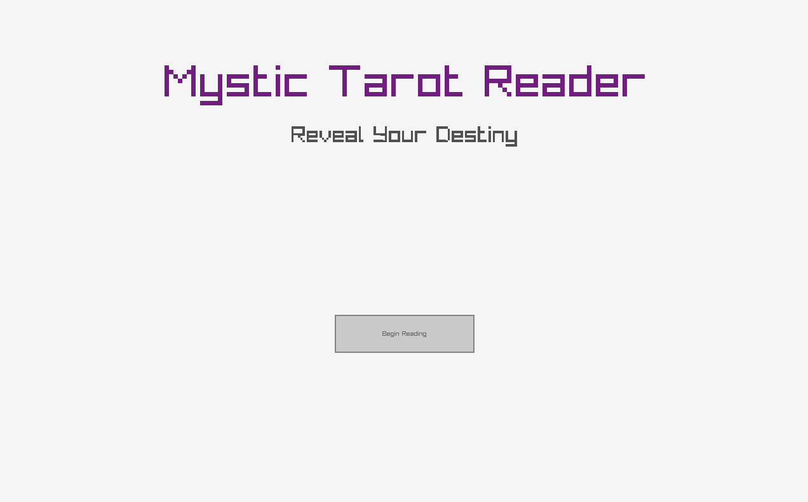
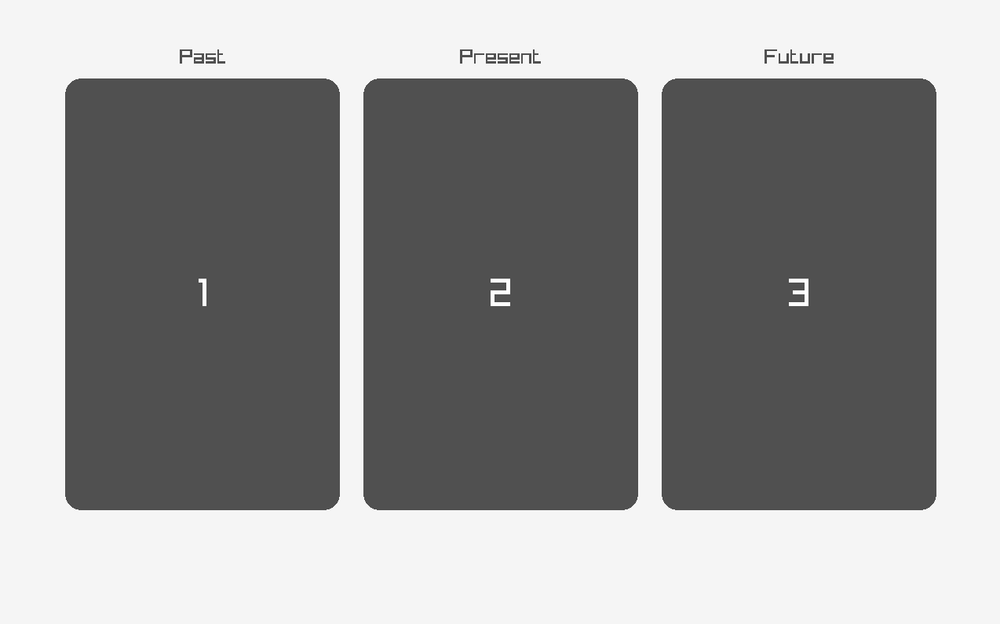

```markdown
# Mystic Tarot Reader 🔮  
**โปรแกรมดูดวงไพ่ยิปซีแบบอินเทอร์แอคทีฟ**  

## 📜 เนื้อหา (Table of Contents)
- [คุณสมบัติหลัก (Features)](#คุณสมบัติหลัก-features)
- [การติดตั้ง (Installation)](#การติดตั้ง-installation)
- [วิธีการใช้งาน (Usage)](#วิธีการใช้งาน-usage)
- [เทคนิคที่ใช้ (Technologies)](#เทคนิคที่ใช้-technologies)
- [ผู้พัฒนา (Developer)](#ผู้พัฒนา-developer)

---

## คุณสมบัติหลัก (Features)
- 🃪 สุ่มไพ่ยิปซี 3 ใบ (อดีต-ปัจจุบัน-อนาคต)
- 🔍 แสดงคำทำนายละเอียดในกรอบการ์ด
- 🎨 อินเทอร์เฟซกราฟิกสวยงาม (GUI) ด้วย Raylib
- 🎲 สีพื้นหลังการ์ดสุ่มแบบพาสเทล
- 📊 แถบสรุปผลลัพธ์แบบเรียลไทม์

---

## การติดตั้ง (Installation)
### ข้อกำหนด (Prerequisites)
- [CMake](https://cmake.org/) เวอร์ชัน 3.10 ขึ้นไป
- [Raylib](https://www.raylib.com/) เวอร์ชัน 4.5 ขึ้นไป

### ขั้นตอน (Steps)
1. โคลนโปรเจกต์:
   ```bash
   git clone https://github.com/peeraphat8190/MysticTarotReader.git
   ```
2. สร้างโฟลเดอร์ build และคอมไพล์:
   ```bash
   cd mystic-tarot-reader
   mkdir build && cd build
   cmake ..
   cmake --build . --config Release
   ```
3. รันโปรแกรม:
   - Windows: `build/Release/FinalProject.exe`
   - Linux/macOS: `./FinalProject`

---

## วิธีการใช้งาน (Usage)
1. **เริ่มโปรแกรม**: กดปุ่ม "Begin Reading" ในหน้าจอเริ่มต้น  
   

2. **เลือกไพ่**: คลิกไพ่ตามลำดับ (Past → Present → Future)  
   

3. **อ่านคำทำนาย**: คำทำนายจะแสดงในกรอบการ์ดแต่ละใบ  
   

---

## เทคนิคที่ใช้ (Technologies)
- **ภาษาโปรแกรม**: C (C11 Standard)
- **ไลบรารีกราฟิก**: [Raylib](https://www.raylib.com/) + [RayGUI](https://github.com/raysan5/raygui)
- **เครื่องมือ**: CMake, Git
- **แนวคิดการเขียนโปรแกรม**:
  - Selection Statements (`if-else`)
  - Loop Statements (`for`, `while`)
  - Arrays & Strings
  - Functions & Modular Programming

---

## ผู้พัฒนา (Developer)
- **ชื่อ**: [Peeraphat]  
- **รหัสนักศึกษา**: [1670903192]  
- **วิชา**:  CE213
- **GitHub**: (https://github.com/peeraphat8190)

---

# Mystic Tarot Reader 🔮  
**Interactive Tarot Card Fortune Telling Program**  

## 📜 Table of Contents
- [Features](#features)
- [Installation](#installation)
- [Usage](#usage)
- [Technologies](#technologies)

---

## Features
- 🃪 Draw 3 Tarot Cards (Past-Present-Future)
- 🔍 Display Detailed Predictions In-Card
- 🎨 Beautiful GUI with Raylib
- 🎲 Random Pastel Card Colors
- 📊 Real-Time Summary Panel

---

## Installation
### Prerequisites
- [CMake](https://cmake.org/) (v3.10+)
- [Raylib](https://www.raylib.com/) (v4.5+)

### Steps
1. Clone the repository:
   ```bash
   git clone https://github.com/peeraphat8190/MysticTarotReader.git
   ```
2. Build the project:
   ```bash
   cd mystic-tarot-reader
   mkdir build && cd build
   cmake ..
   cmake --build . --config Release
   ```
3. Run the program:
   - Windows: `build/Release/FinalProject.exe`
   - Linux/macOS: `./FinalProject`

---

## Usage
1. **Start**: Click "Begin Reading" on the start screen.  
   

2. **Select Cards**: Click cards in order (Past → Present → Future).  
   

3. **Read Predictions**: Detailed predictions appear inside each card.  
   

---

## Technologies
- **Language**: C (C11 Standard)
- **Graphics**: [Raylib](https://www.raylib.com/) + [RayGUI](https://github.com/raysan5/raygui)
- **Tools**: CMake, Git
- **Programming Concepts**:
  - Selection Statements (`if-else`)
  - Loop Statements (`for`, `while`)
  - Arrays & Strings
  - Functions & Modular Programming
